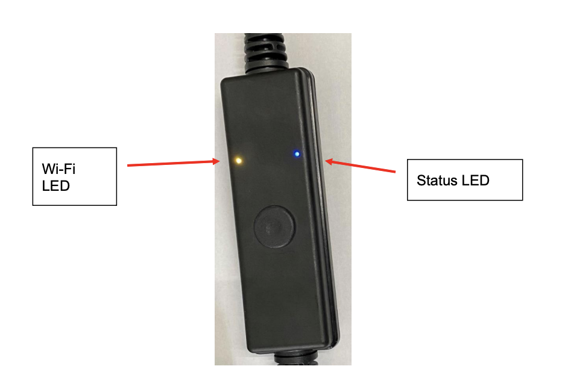

# This repository is part of the Quick Start Devkit Project
Use this script to connect your phisical device to the Cloud, after deploying your infrastructure

## Configure your Device
### Overview
**LEDS**  

There are 2 LEDs on the Smart Power Cord.  
**Status LED**:
Blue, in normal operation LED used to indicate relay on/off status.

Relay is on &rarr; Blue LED is on

**Wi-Fi LED**:  
On factory reset &rarr; Solid red for 1 second, then off  
On reboot &rarr; Solid green for 1 second, then off  
In provisioning state &rarr; Yellow slow (2x) flash  
Connecting to Wi-Fi &rarr; Yellow fast (20x) flash  
Failed connect Wi-Fi &rarr; Yellow solid  
Connecting to AWS &rarr; Green slow (2x) flash  
Connection to AWS &rarr; Green on for 5 seconds, then off  
Failure to connect AWS &rarr; Red slow (2x) flash  

When holding the cord with the Push button below the LEDs, the Wi-Fi LED is on
the upper left and the Status LED is on the upper right as shown below. 



### Push Button
The push button on the Smart Power Cord can be used to manually turn on and off
any device that is plugged into the Smart Power Cord.

| **Push button**                                                                                                           | **Wi-Fi LED**            |
|---------------------------------------------------------------------------------------------------------------------------|--------------------------|
| Holding button for 5 seconds does a reboot                                                                                | flash green for 1 second |
| Holding button for 10 seconds does a full factory reset                                                                   | flash red                |
| Press the push button down for 1 second to toggle the relay and turn on / off a device plugged into the Smart Power Cord. | N/A                      | 

The push button is used to provision the Smart Power cord on the ConnectSense
Cloud application. If you hold down the push button for roughly 10 seconds it will reset
the Smart Power Cord to default configuration and put the Wi-Fi interface into SoftAP
mode so that it can be provisioned onto the customer’s network and the
ConnectSense cloud application.

**SoftAP**  
The ConnectSense Smart Power Cord has an internal Wi-Fi radio. The Wi-Fi can be
used in 2 different modes:
1. Client Station mode – to connect to network Access Points (APs)
2. SoftAP mode – allows host computers to connect to it for configuration  

For provisioning the Smart Power Cord to the cloud, we use the “SoftAP” or soft
access point. The use of the SoftAP is temporary and is only enabled during the
provisioning process. To Provision the Smart Power Cord to the ConnectSense
Cloud, you need to make a Wi-Fi connection from a host computer to the SoftAP
wireless connection in the Smart Power Cord. Once the Smart Power Cord is
connected to the cloud, the SoftAP is disabled for security.


## Connecting Your ConnectSense Device and Pushing Data

1. Go to `device-connection` folder (this project uses python3.8)
2. Install the dependencies
3. Fill the `conf-staging-example.txt` file with the data of your environment. You can find the `iotURL` with the command:
```bash
aws iot describe-endpoint --endpoint-type iot:Data-ATS
```
4. Connect the device that will run this script to the SoftAP of the device
5. Run the python script. `$ python cs-cord-dk-prov.py -h` will show the help section
6. `$ python cs-cord-dk-prov.py conf conf-staging-example.txt` will register your device in your AWS environment
